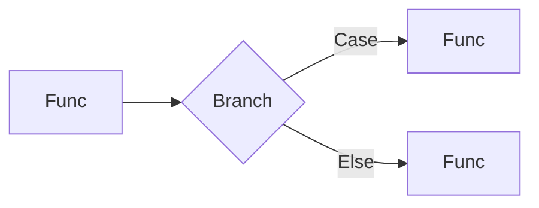
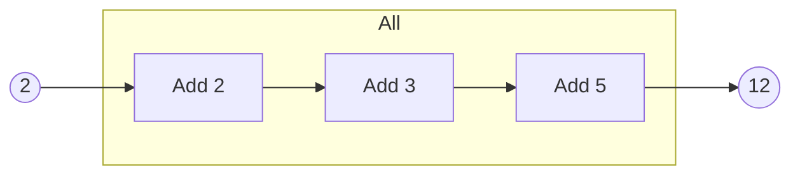
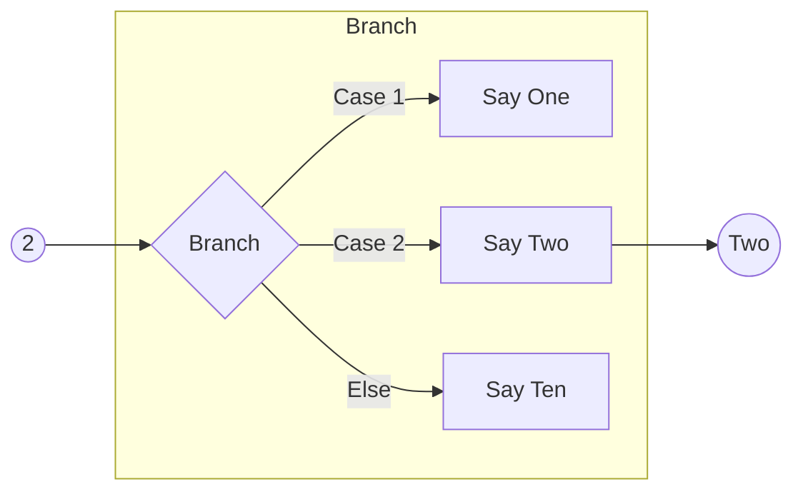
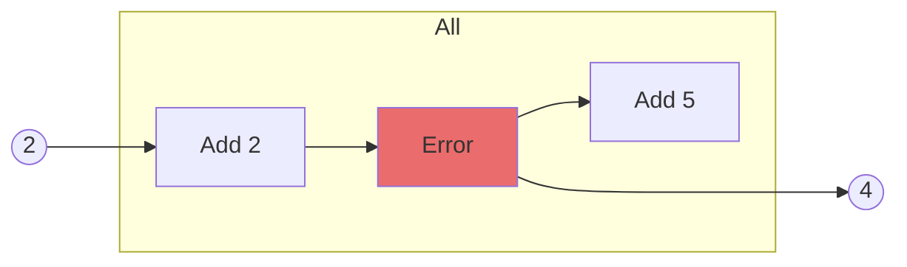
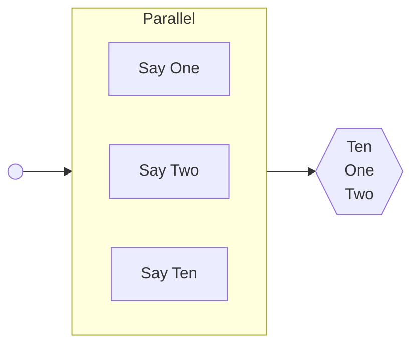

# ADT

This library makes it easy to build and change business logic.

It makes code:

- match flow diagrams.
- easy to read.
- easy to test.
- modular.

## Install

```
go get github.com/ofabricio/adt
```

## Example

```go
package main

import "fmt"
import . "github.com/ofabricio/adt/a"

func main() {

    fizzbuzz := Branch(
        Case(And(IsMod(3), IsMod(5)), Print("FizzBuzz")),
        Case(IsMod(3), Print("Fizz")),
        Case(IsMod(5), Print("Buzz")),
        Else(PrintIndex),
    )

    for i := 1; i <= 15; i++ {
        fizzbuzz.Run(i)
    }

    // Output:
    // 1 2 Fizz 4 Buzz Fizz 7 8 Fizz Buzz 11 Fizz 13 14 FizzBuzz
}

func IsMod(v int) Cond[int] {
    return func(i int) bool {
        return i%v == 0
    }
}

func Print(s string) Func[int] {
    return func(int) error {
        fmt.Print(s, " ")
        return nil
    }
}

func PrintIndex(i int) error {
    fmt.Print(i, " ")
    return nil
}
```

Don't let this simple example fool you.
It's not showing this lib true power.
This is a very simple, yet powerful lib.

For a more complex real life example see [here]().

## About

This lib makes code maintainable.
You can plug and unplug functions and conditions like Lego;
and run parallel code with a single change.
Also your code will look like your flow diagram and this allows you to
change your code as easy as changing your diagram.

Think of a function (`Func[T]` type) as the rectangular boxes in a flow diagram;
and think of a branch ([Branch](#Branch) operator) as the diamonds in a flow diagram.
Do that and you're good to go.



## Operators

- [Run](#Run)
- [Branch](#Branch)
- [Case](#Case)
- [Else](#Else)
- [All](#All)
- [Retry](#Retry)
- [Catch](#Catch)
- [On](#On)
- [Parallel](#Parallel)
- [Semaphore](#Semaphore)

### Run

Run runs the ADT. It is the entry point where you feed the tree with the input for processing.

```go
import . "github.com/ofabricio/adt/a"

func Example() {

    a := All(Add(2), Add(3), Add(5))

    job := 2
    err := a.Run(&job)

    fmt.Println(job, err)

    // Output:
    // 12 <nil>
}

func Add(n int) Func[*int] {
    return func(v *int) error {
        *v += n
        return nil
    }
}
```

The code above matches this diagram:



**Tip!** You can use complex structs as a job input so that you can have context, etc. Example:

```go
type Job struct {
    Input  map[string]int  // Just an input example.
    Result map[string]int  // Maybe you want the result separately.
    mut    sync.Mutex      // Maybe you want concurrency control.
    ctx    context.Context // Maybe you want context.
    log    log.Logger      // Maybe you want log.
}
```

### Branch

Branch operator works like a switch statement,
it runs the first case that evaluates to true.

Inside a branch you can use `Case` and `Else` operators.

- `Case` runs its function if its condition evaluates to true.
- `Else` always runs its function because it always evaluates to true.

**Note** that you can use `Branch` inside a `Case` or `Else` to create a decision tree.

```go
func Example() {

    a := Branch(
        Case(Is(1), Say("One")),
        Case(Is(2), Say("Two")),
        Else(Say("Ten")),
    )

    a.Run(2)

    // Output:
    // Two
}

func Is(n int) Cond[int] {
    return func(v int) bool {
        return v == n
    }
}

func Say(msg int) Func[int] {
    return func(v int) error {
        fmt.Println(msg)
        return nil
    }
}
```

The code above matches this diagram:



### Case

Case is part of the `Branch` operator.
It runs its function if its condition evaluates to true. See [Branch](#Branch) operator example.

### Else

Else is part of the `Branch` operator.
It always runs its function because it always evaluates to true.
See [Branch](#Branch) operator example.

### All

All runs functions sequentially.
It stops if one of them returns an error.

```go
func Example() {

    a := All(Add(2), Add(3), Add(5))

    job := 2
    a.Run(&job)

    fmt.Println(job)

    // Output:
    // 12
}
```

The code above matches this diagram:


Now supposing that `Add(3)` failed, it would behave like this:



### Retry

Retry retries a function if it returns an error.

```go
func Example() {

    a := All(Say("One"), Say("Two").Retry(2), Say("Ten"))

    a.Run(0)

    // Output:
    // One
    // Oops
    // Two
    // Ten
}
```

Suppose that `Say("Two")` returns and prints an error `Oops` the first time it runs.
The output would be like the above.

### Catch

Catch is called when an error happens.

```go
func Example() {

    a := All(Say("One"), Say("Two").Catch(Handle), Say("Ten"))

    a.Run(0)

    // Output:
    // One
    // Oops
    // Got the error oops, but it's fine now. Keep going.
    // Ten
}

func Handle(v int, err error) error {
    fmt.Printf("Got the error %v, but it's fine now. Keep going.\n", err)
    return nil
}
```

Suppose that `Say("Two")` returns and prints an error `Oops` the first time it runs.
The output would be like the above.

### On

On is called on either success or error.

```go
func Example() {

    a := Say("One").On(Handle)

    a.Run(0)

    // Output:
    // One
    // 0 nil
}

func Handle(v int, err error) error {
    fmt.Println(v, err)
    return err
}
```

### Parallel

Parallel runs functions concurrently.
It awaits until all functions are complete.
It returns the first error found.

```go
func Example() {

    a := Parallel(Say("One"), Say("Two"), Say("Ten"))

    a.Run(0)

    // Output:
    // Different output on each run.
}
```

The code above matches this diagram:



### Semaphore

Semaphore is like [Parallel](#Parallel),
but you control the number of go routines it uses.

```go
func Example() {

    a := Semaphore(2, Say("One"), Say("Two"), Say("Ten"))

    a.Run(0)

    // Output:
    // Different output on each run.
}
```
